# Report - Universal Cereal Bus

## Table of Contents

- [Linux](#linux)
- [Blockchain](#blockchain)
- [OSINT](#osint)
- [Web](#web)
- [Rev](#rev)
- [Crypto](#crypto)
- [Forensics](#forensics)

# Linux

```
challenge names: ls, exec, sudo, editor, ls_all, cat, grep, find
connection_info: linux.chals.hackmac.xyz
"Open a ticket in the Discord server in the #request-support channel to receive ssh login credentials for this challenge."
https://www.ssh.com/academy/ssh\r\nhttps://youtu.be/v45p_kJV9i4
```

For these challenges I didn't save my flag, login details or take screenshots, but throughout the challenges I researched what each command did. In particular, the difficulties I had were with exec and sudo.

A couple of useful links I used:

https://www.baeldung.com/linux/exec-command-in-shell-script
https://phoenixnap.com/kb/linux-sudo-command

In particular, for the sudo challenge, I referred to this writeup for a different challenge:

https://www.rootusers.com/ruxcon-ctf-2017-unix1-write-up/

As I saw the fd showed that only `coworker` could access the file that I needed to access, and similarly in that write up, only another user could access the file:

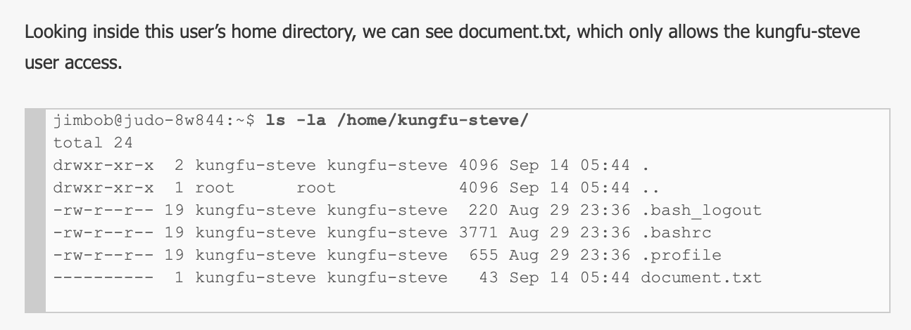


# Blockchain

```
connection_info: https://blockz.hackmac.xyz
"Let's get set up.
Please open a ticket in the #request-support channel in the Discord server to recieve a private key for a wallet with 100ETH.
This wallet and private key will be used for all of the Blockchain challenges.
100ETH is more than you will ever need to complete these challenges, so use it sparingly.
You really shouldn't need more than 1 or 2 ETH AT MOST to complete a challenge, and this is usually refunded back to you on completion.
These challenges are taken from https://ethernaut.openzeppelin.com
There are writeups available online if you are stuck.
Try your best to solve them yourself for optimum learning, I've picked out the low difficulty ones."
```

For the more difficult challenges, this writeup was helpful to understand where to start looking: https://infosecwriteups.com/blockchain-hacking-smart-contract-with-ethernaut-ctf-part-1-cb439d6c34fe

```
challenge: Hello HackMac
```

The point of this challenge was to get familiar with the console in the developer tools. I'd never really used JavaScript before, much less Solidity, so this was all very new. As I played around with the commands, I found out I could call the functions on the "objects", such as the player, the owner, and the contract.

For this challenge, it was a matter of finding the contract password (by using password()) and then calling the authenticate function, and passing in the password: `contract.authenticate(password)` (unfortunately I cannot recall the exact password and forgot to write it down)

**flag:** `HACKMAC{are_you_satoshi_nakamoto}`

```
challenge: Fallback
```

There was both a function named `Fallback` and an actual fallback function (i.e. nameless function used when "contract receives ether or when someone calls the function not in the contract or the parameter is incorrect")

The steps to getting the flag were to contribute() to the contract, send(1) ether to the contract, check that ownership has been transferred (contract.owner()) and then withdraw all the money (contract.withdraw()).

**flag:** `HACKMAC{fallback_neq_trustfall!}`

```
challenge: Fallout
```

This challenge was just a matter of calling the Fal1out function (not a constructor) - NOTE the leetspeak spelling, since the code will cause the message sender to become the owner:

```Solidity
owner = msg.sender;
allocations[owner] = msg.value;
```

**flag:** `HACKMAC{fallout_of_love_with_NFT's_pepesmile}`

# OSINT

```
challenge: In depth
connection_info: https://www.facebook.com/people/Vekin-Huc/100073429656689/
"Sigh, I accidentally leaked the flag image for a challenge to my friend. Can you find where he leaked it for me?"
```

Rabbit trail of social medias:


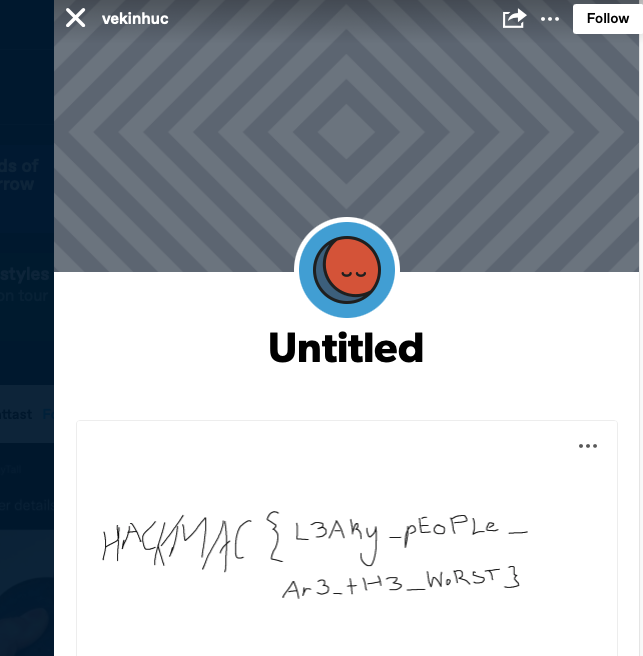

**flag:** `HACKMAC{L3Aky_pEoPLe_Ar3_tH3_WoRST}`

```
challenge: Git Gud
connection_info: https://github.com/victornikolic98
"Click on the link below to get started! Don't look too hard ;)"
```

**flag:** `HACKMAC{TheGitReposAreRedHerrings}`

```
challenge: SocialMediaInspection
"We have identified a username associated with one of the suspects: `jthan0434`. They seem to play social media a lot. Maybe we can find a hint from any of their post about the secret website they have been using?"
```

**flag:** `HACKMAC{JonaThanisSOcool}`

**UNSOLVED, but tried hard**

```
challenge: Stolen Vehicle
"Randal Rozza is a suspected criminal of stealing a motor vehicle. A team of contracted investigators have been deployed to find any suspicious activity from his online presence. The suspect has been wanted by the police for some time now. The police have suspicion on how he has this much money. The suspect and his acquaintances are known to be very active on twitter and flaunting his wealth. You have been asked to join as an online team of detectives to locate incriminating evidence.
https://twitter.com/randalrozza
Objective: Using all intel/resources you have been allocated, locate the stolen vehicle's VIN number.
The flag will be in the format with NO SPACES and ALL CAPS HACKMAC{vehicleidentificationnumber}"
```

**flag:** `HACKMAC{WUAZZZ421DN000811}`

# Web

```
challenge: Beep Boop
connection_info: https://beep-boop-web.chals.hackmac.xyz
"It's always good to keep memories of the past incase the terminator movie becomes a reality..."
```

The `Beep Boop` hints to needing to navigate to `robots.txt`. In doing so, the flag file path is in the `Disallow:` section.

**flag:** `HACKMAC{are_you_a_robot84357}`

```
challenge: warehouse
connection_info: https://warehouse-web.chals.hackmac.xyz
"Just give it a good ol' jab and she'll be alright"
```
`warehouse` hints to SQL, and `jab` hints to injection.

By researching on this page https://en.wikipedia.org/wiki/SQL_injection (and trying everything there), the exploit that worked was: `' OR '1'='1' --`

**flag:** `HACKMAC{jabb3d_w1th_th3_BOOLEAN}`

# Rev

```
challenge: SecretClub1
"I would love to tell you everything about this secret club... but you know the rule."
Attached files: SecretClub1.java
```

Since the `checkPassword()` function checks that the bytes in the given password are **3 more** than the expected bytes:

```Java
if (passBytes[i]+3 != myBytes[i]) {
    return false;
}
```

Wrote a script that **subtracts 3** from each byte:

```Java
byte[] myBytes = {
    102, 68, 54, 86, 100, 85, 98, 117, 
    0x36, 0x59, 0x36, 0x75, 0x38, 0x68, 0x67, 0x62, 0x6c, 
    '8', 'b', 'u', 'D', 'v', '6', 'D', 'f',
};

byte[] phrase = new byte[myBytes.length];

for (int i = 0; i < myBytes.length; i++) {
    phrase[i] = (byte)(myBytes[i] - 3);
}

String result = "HACKMAC{";

result += new String(phrase, StandardCharsets.UTF_8);

result += "}";

System.out.println(result);
```

**flag:** `HACKMAC{cA3SaR_r3V3r5ed_i5_rAs3Ac}`

```
challenge: SecretClub2
"Can you find the secret password to join the VIP of the Secret club that for some reason no one is allowed to talk about?\nI hear that if your a VIP member, you are amongst some of the most skilled CTF challengers in the club!"
Attached files: SecretClub2.java
```

This requires a length of 32 (32 bytes), and each group of 4 bytes is manipulated so that one after the other, they combine to generate the numbers:

```Java
return x[0] == 1650029619 && x[1] == 2053059694 && x[2] == 1147093553 && x[3] == 1312060025 && x[4] == 1599091811&& x[5] == 1261530681 && x[6] == 1600730463 && x[7] == 1664118604;
```

Additionally, the shift of 24, 16, 8, and 0, signified that the input bytes would be found by just segmenting each number into 4 bytes, one for each letter.

(I lost the script that reverses this, but the concepts from above applied in reversing the bytes)

**flag:** `HACKMAC{bYt3z_4nD_B1N4ry_P4cK1n9_i5_c0oL}`

# Crypto

```
challenge: Find the Message
"You are assigned to find a message that contains a password that will allow you authenticate the systems of Macquarie. However, there is a twist in finding the solution of the message so keep an eye onto the scheme into how to decrypt the message."
Attached Files: find_the_message.py
```
The first trick to this one was that the code was missing the opening quotation marks at the start of the binary string (added in below):

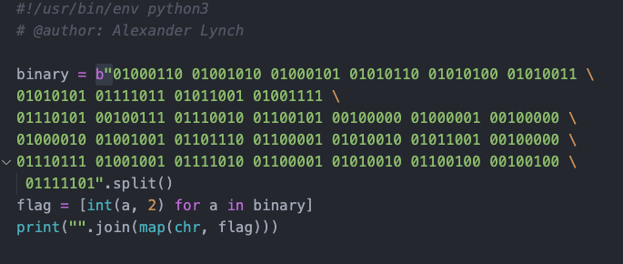

Running the code at this point created the output: `FJEVTSU{YOu're A BInaRY wIzaRd$}`

This looks like a flag, but it didn't have the `HACKMAC` at the front. Since F → J has 3 letters in between, and H → A has much more than that, it couldn't just be a standard shift (i.e. not ROT13 or some other Caesar offset), so I settled on adding letters to a passphrase until I had HACKMAC at the front:

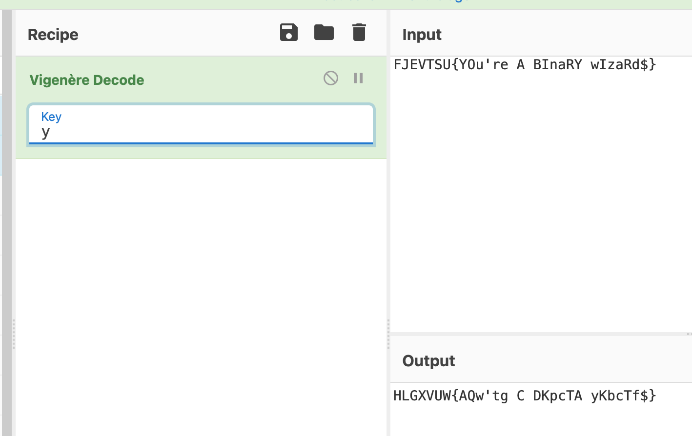
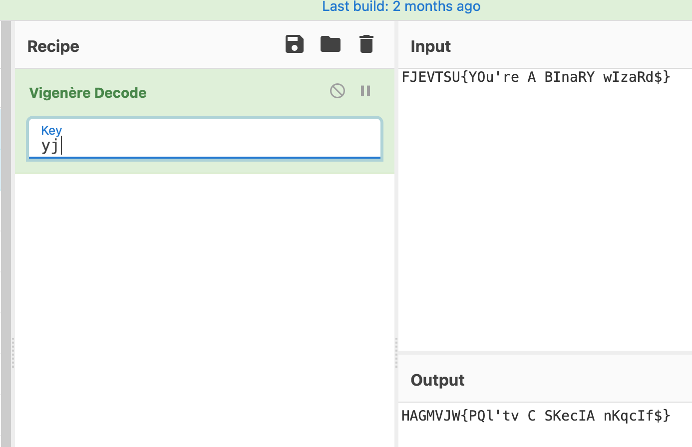
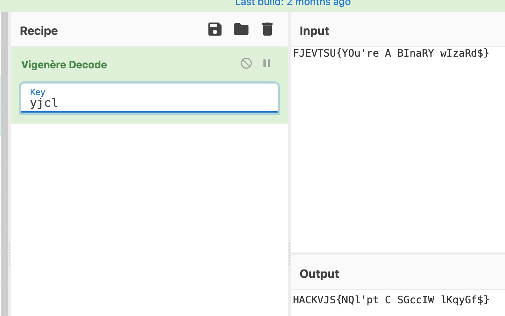
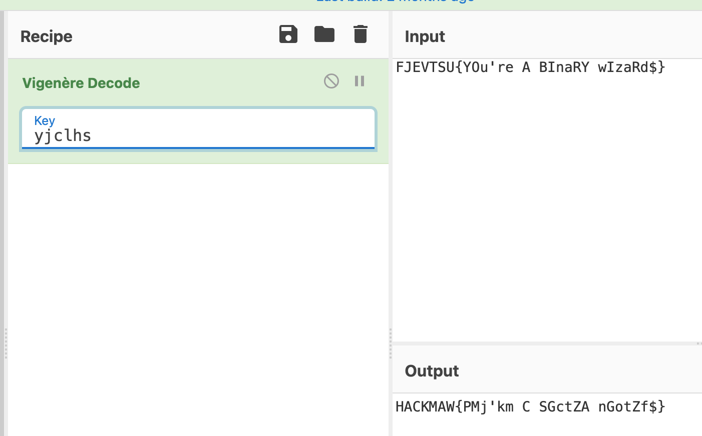
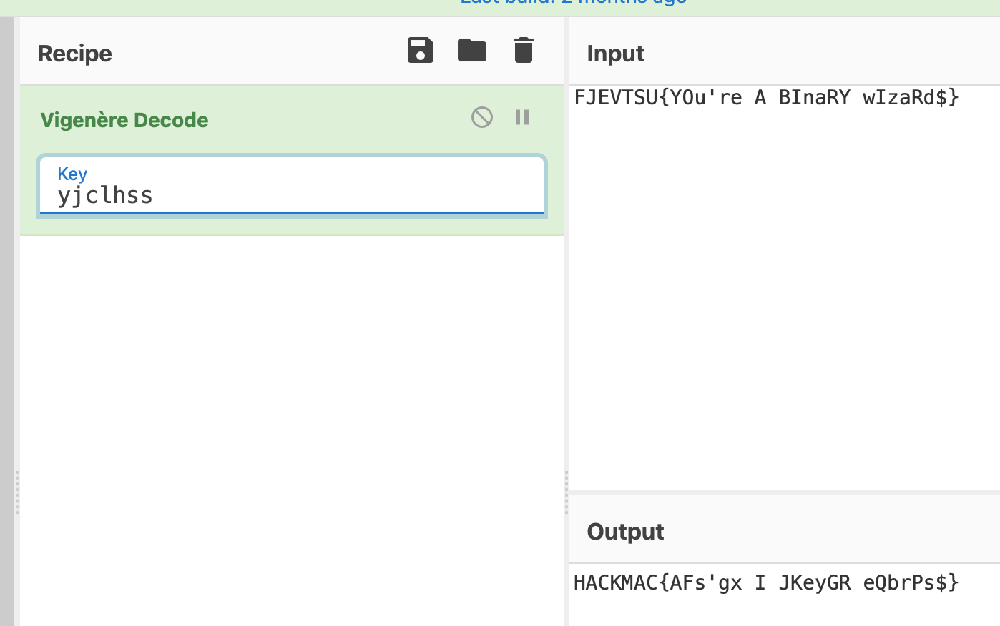

Resulting in a passphrase of: `yjclhss` and the below:

**flag:** `HACKMAC{AFs'gx I JKeyGR eQbrPs$}`

# Forensics

```
challenge: CatHex
"This is CAT ERAAAAAAAAAAA!!!!"
Attached Files: CAT.jpg
```

Running the `strings` command on the jpg file gives: `HCBKMCB{b4TB43s4RsTyl3}`

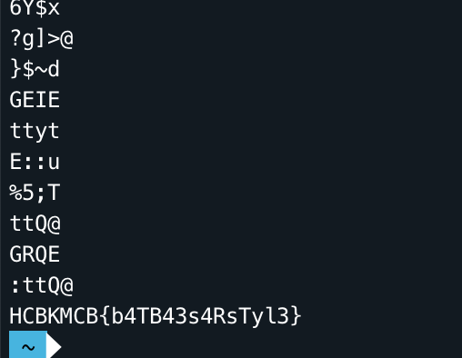

It definitely looks like it requires a shift of some sort, but since some letters such as the `H` and `K` are in the correct spots, it doesn't appear to be the same shift for all letters.

However, there is an annotation on the image:

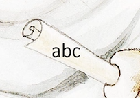

This points to a likely shift between these letters, and by turning C → A and B → C we get:

**flag:** `HACKMAC{c4TC43s4RsTyl3}`

```
category: Flagflagflagflag
"I got my friend to paint me a picture but I can no longer see it"
Attached files: flag
```

The flavour text hints to the file needing to be in a `picture` format, but no longer showing up properly. Since it's a forensics challenge, this hints at a corrupted jpeg / png.

By putting the file into `hexed.it` (https://hexed.it):

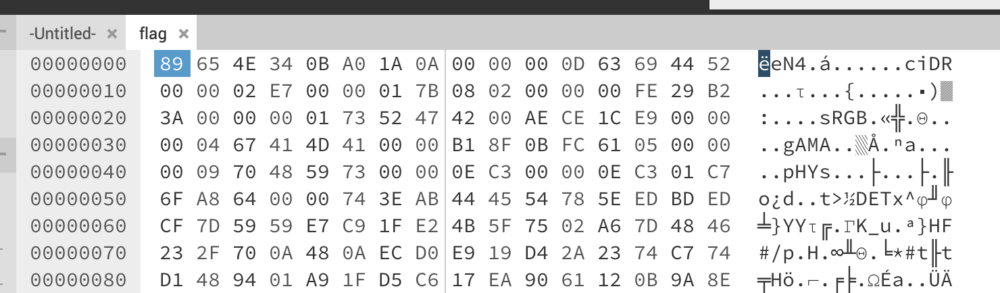

It looks like a corrupted png file (due to the byte arrangement).

Two links that helped me identify which bytes needed changing were:

http://www.libpng.org/pub/png/spec/1.2/PNG-Structure.html
https://en.wikipedia.org/wiki/Portable_Network_Graphics

Including this table:

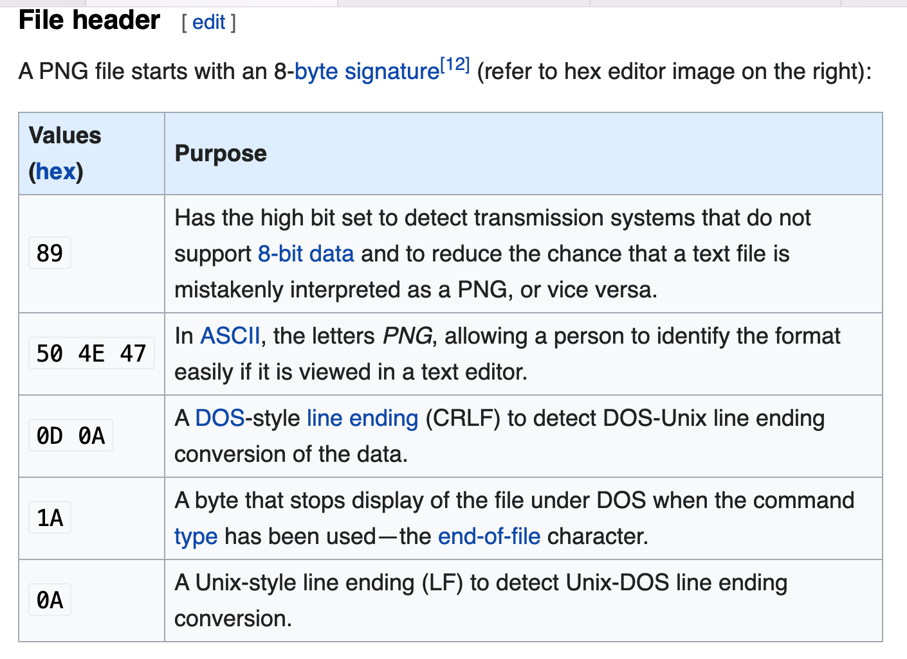

Changing the header:

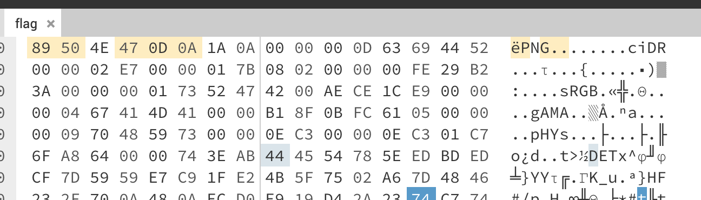

At this point, I still couldn't open it, but I used the `pngcheck` tool that helped me identify what else needed changing, e.g.:

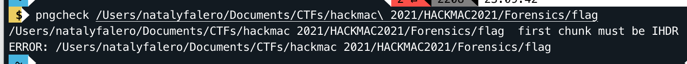

I used the links above to figure out what this meant.

Eventually after changing the necessary bytes, I re-exported the file and was able to open the png:

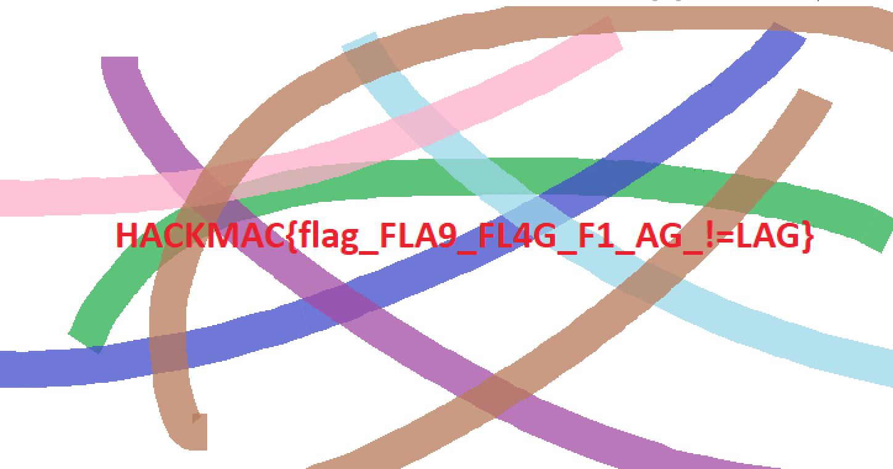

**flag:** `HACKMAC{flag_FLA9_FL4G_F1_AG_!=LAG}`

